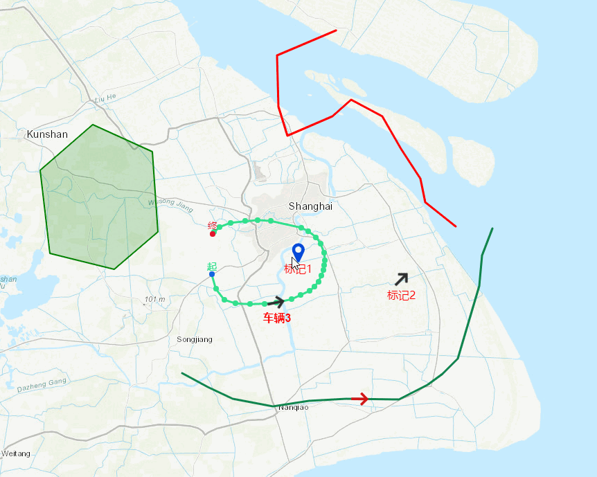

### openlaysers-demo

一些openlaysers6的demo，vue2 + vite作为框架。

####  [在线演示](https://liyang5945.github.io/openlayers-demo)


功能实现

- 根据已有坐标绘制标记、线段、多边形。
- 手动在地图上添加标记、线段、多边形，并获取坐标。
- 动态改变地图标记物样式、文字。
- 单击地图标记物弹出popup窗口、地图标记物右键菜单。
- 根据websocket推送数据改变标记位置。
- 历史轨迹功能、轨迹动画功能。
- 图层切换功能。

动图演示：



### 安装使用

``` bash

# 安装依赖
npm install

# 开发运行
npm run dev

# 构建生产
npm run build

```


